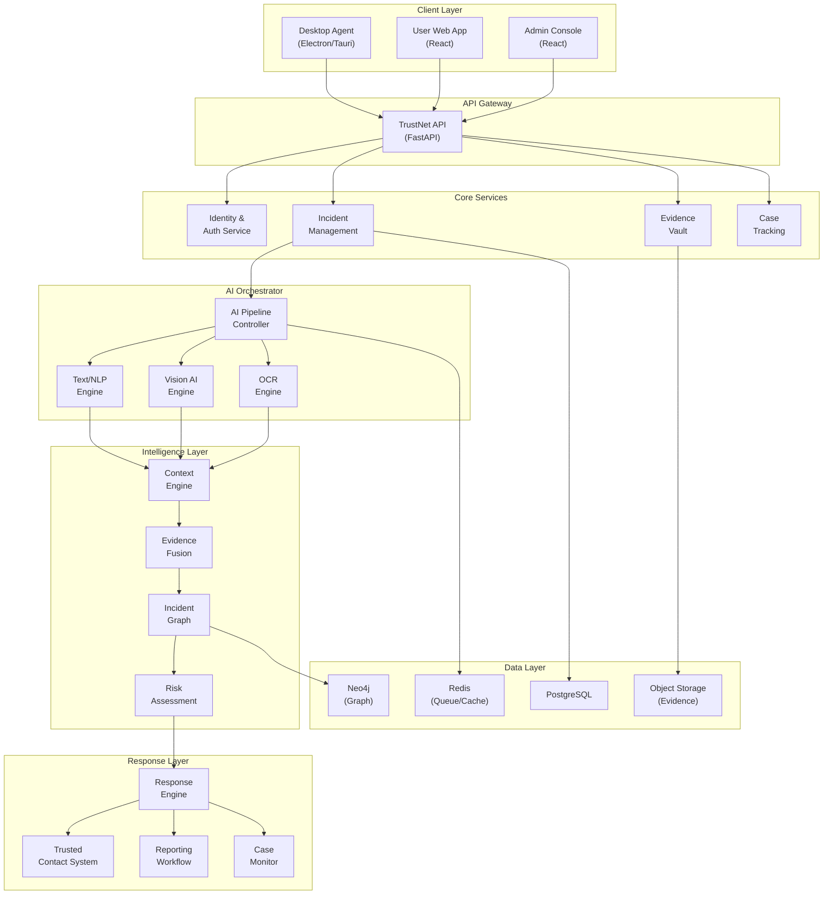
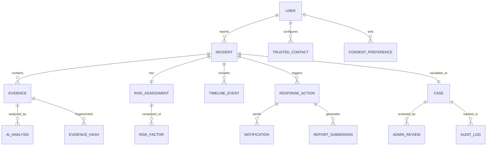

# TRUSTNET — SIH Model Document

## AI-Powered Digital Harm Detection, Evidence Intelligence & Automated Response Platform

---

> **One-Line Pitch:**
> TrustNet uses multimodal AI to detect harmful digital situations, automatically organize and preserve evidence, assess severity with explainable scoring, and—under predefined consent and safety rules—connect the affected person with trusted support or appropriate reporting channels.

> [!IMPORTANT]
> **Core Innovation:** TrustNet does not merely detect harmful content. It answers:
> *"A harmful situation has been detected — what should happen next, safely and automatically?"*

---

## 1. Problem Statement

### 1.1 The Actual Problem

When a person experiences digital harm—harassment, threats, deepfakes, intimate-image abuse, cyberbullying, extortion, or content indicating severe emotional distress—the burden falls entirely on the **victim** to:

1. Recognize the severity
2. Manually collect scattered evidence (screenshots, messages, profiles)
3. Figure out who to contact
4. Navigate complex reporting mechanisms
5. Preserve evidence integrity (before it's deleted)
6. Manage their own emotional safety while doing all of the above

**No existing system automates this workflow.**

### 1.2 The Chain That Must Be Automated

```
Harmful Content
       ↓
Who is affected?
       ↓
How serious is it?
       ↓
Is it escalating?
       ↓
What evidence exists?
       ↓
What happened first? (timeline)
       ↓
Who should be informed?
       ↓
What safe action should be taken?
```

**Current solutions stop at step 1.** TrustNet automates steps 1–8 while keeping humans in control of consequential actions.

### 1.3 Why Existing Solutions Fail

| Existing Approach | What It Does | What It Misses |
|---|---|---|
| Platform content moderation | Removes violating posts | Doesn't preserve evidence, doesn't help the victim |
| Deepfake detectors | Flags manipulated media | No context, no severity, no response |
| Cybercrime portals | Accept complaints | Require the victim to manually compile everything |
| Parental control apps | Block/filter content | No forensic intelligence, no response workflow |
| Antivirus/security suites | Detect malware/phishing | Ignore social/psychological harm vectors |

> [!NOTE]
> **TrustNet's differentiator:** It is the first system that treats digital harm as an **evolving incident** requiring an **intelligent response pipeline**, not as an isolated content classification problem.

---

## 2. System Architecture

### 2.1 Four-Layer Architecture

```
┌─────────────────────────────────────────────┐
│              TRUSTNET AGENT                 │
│   Consent-based evidence discovery          │
│   (Desktop Agent + Web App)                 │
└──────────────────────┬──────────────────────┘
                       ↓
┌─────────────────────────────────────────────┐
│             TRUSTNET AI ENGINE              │
│   Text + Image + Video + OCR + Context      │
│   (Multimodal Analysis Pipeline)            │
└──────────────────────┬──────────────────────┘
                       ↓
┌─────────────────────────────────────────────┐
│         TRUSTNET INCIDENT INTELLIGENCE      │
│   Graph + Risk + Timeline + Evidence        │
│   (Evidence Fusion & Correlation)           │
└──────────────────────┬──────────────────────┘
                       ↓
┌─────────────────────────────────────────────┐
│           TRUSTNET RESPONSE ENGINE          │
│   Alert + Support + Reporting + Tracking    │
│   (Automated Safety Workflows)             │
└─────────────────────────────────────────────┘
```

### 2.2 Complete Technical Architecture



### 2.3 Client Applications

| Application | Technology | Purpose |
|---|---|---|
| **Desktop Agent** | Tauri (Rust + Web) | Consent-based local evidence discovery, privacy filtering, secure upload |
| **User Web App** | React + TypeScript | Submit evidence, view incidents, manage safety preferences, track cases |
| **Admin Console** | React + TypeScript | Incident review, AI audit, case management, system monitoring |

---

## 3. AI Engine — Multimodal Analysis Pipeline

### 3.1 Design Principle: No Single Model Does Everything

```
                    TRUSTNET AI
                         │
       ┌─────────────────┼─────────────────┐
       ↓                 ↓                 ↓
   TEXT/NLP           VISION AI          OCR
       │                 │                 │
       ↓                 ↓                 ↓
 Threat/Harassment   Media Signals    Screenshot Text
       │                 │                 │
       └─────────────────┼─────────────────┘
                         ↓
                  Context Engine
                         ↓
                  Risk Engine
                         ↓
                 Response Engine
```

Each specialized component is:
- **Independently testable** — can validate accuracy per modality
- **Independently updatable** — swap a model without breaking the pipeline
- **Explainable** — each component's contribution to the final risk score is traceable

### 3.2 Text Safety Engine (NLP)

**Purpose:** Classify textual content into harm categories with calibrated confidence.

**Classification Categories:**
| Category | Description |
|---|---|
| `HARASSMENT` | Targeted, repeated hostile/degrading language |
| `THREAT` | Direct or implied threats of violence or harm |
| `BULLYING` | Intimidation, humiliation, social exclusion tactics |
| `COERCION` | Pressure, manipulation, control-oriented language |
| `BLACKMAIL` | Conditional threats tied to demands |
| `SEXUAL_EXPLOITATION` | Grooming patterns, exploitation indicators |
| `SELF_HARM_DISTRESS` | Language indicating severe emotional distress |
| `NON_HARMFUL` | No harmful signals detected |
| `UNCERTAIN` | Model cannot classify with sufficient confidence |

**Output Format (never claims certainty):**
```json
{
  "category": "THREAT",
  "confidence": 0.91,
  "evidence_signals": [
    "Direct threatening language",
    "Targeted recipient identified",
    "Escalation indicator from prior messages"
  ],
  "requires_human_review": false
}
```

**Technical Approach:**
- Fine-tuned transformer classifier (e.g., DeBERTa-v3 or similar) on curated harm taxonomy
- Confidence calibration via temperature scaling — model outputs probabilities, not certainties
- Multilingual support via multilingual base model
- Threshold: confidence < 0.60 → automatically flagged for human review

### 3.3 Vision AI Engine

**Purpose:** Classify visual media for safety-relevant signals.

**Classification Levels:**
| Level | Description |
|---|---|
| `SAFE` | No sensitive content detected |
| `SENSITIVE` | Content that may be sensitive in context |
| `SEXUAL` | Sexually explicit content |
| `INTIMATE` | Intimate imagery (non-consensual sharing indicator) |
| `POTENTIALLY_ABUSIVE` | Contextual signals suggest abuse/exploitation |
| `MANIPULATED` | Deepfake or digitally altered media detected |
| `UNCERTAIN` | Model cannot classify with sufficient confidence |

**Critical Context Combination:**
```
Sensitive image
      +
Threatening message ("Send money or I'll publish this")
      +
Evidence of non-consensual distribution

= Potential intimate-image abuse / sextortion indicators
  (much more serious than "nudity detected")
```

**Technical Approach:**
- Image classification: Fine-tuned EfficientNet or similar CNN
- Deepfake detection: Frequency-domain analysis + face consistency checks
- Manipulation detection: Error Level Analysis (ELA) + metadata inconsistency

### 3.4 OCR Engine

**Purpose:** Extract text from screenshots, chat captures, and image-based evidence.

**Technical Approach:**
- Tesseract OCR or cloud OCR API for text extraction
- Layout analysis to preserve chat structure (sender, timestamp, message)
- Extracted text is fed back into the NLP engine for classification

### 3.5 Context Engine — The Glue

**Purpose:** Combine outputs from all AI components to understand the **situation**, not just isolated signals.

```
NLP Output + Vision Output + OCR Output + Metadata + History
                          ↓
                   Context Engine
                          ↓
              Situational Understanding
```

**What the Context Engine does:**
1. **Cross-modal correlation:** "The threatening text references the intimate image" → linked evidence
2. **Temporal analysis:** "Messages are escalating in frequency and severity over 72 hours"
3. **Entity linking:** "The sender account matches a previously flagged fake profile"
4. **Pattern detection:** "This matches known sextortion/blackmail patterns"

> [!TIP]
> The Context Engine is where TrustNet transforms from "a collection of classifiers" into "an intelligent incident analysis system." This is the core intellectual property.

---

## 4. Evidence Intelligence Layer

### 4.1 Digital Incident Graph

**This is TrustNet's strongest technical differentiator.**

Every piece of evidence becomes a node in a graph database (Neo4j). Relationships between evidence pieces are edges.

```
                     Threat Message
                           │
                      "references"
                           │
Fake Account ──────── INCIDENT ──────── Intimate Image
   │                       │                    │
"created_by"          "targets"            "sent_via"
   │                       │                    │
Suspect Profile       Victim User         Chat Platform
                           │
                    ┌──────┴──────┐
                    ↓             ↓
              Timestamp       Evidence Hash
              (ordered)       (SHA-256)
```

**What the graph enables:**
- **"What evidence supports this risk assessment?"** → Traverse the graph from risk node to evidence nodes
- **"Is this person being targeted by multiple accounts?"** → Entity resolution across nodes
- **"What happened first?"** → Topological sort by timestamp edges
- **"Is this connected to a known pattern?"** → Subgraph matching

### 4.2 Evidence Preservation & Integrity

Every piece of evidence is:

| Step | Method | Purpose |
|---|---|---|
| **Captured** | Original file + metadata | Preserve source |
| **Hashed** | SHA-256 fingerprint at ingestion | Tamper detection |
| **Timestamped** | Server-side trusted timestamp | Prove when evidence was captured |
| **Stored** | Encrypted at-rest in Evidence Vault | Confidentiality |
| **Logged** | Every access recorded in audit log | Chain of custody |

```json
{
  "evidence_id": "EV-2026-1021",
  "type": "screenshot",
  "sha256": "a3f2c8d1e5b7...94f0",
  "captured_at": "2026-08-24T12:34:56Z",
  "source": "user_upload",
  "encryption": "AES-256-GCM",
  "access_log": ["user_upload", "ai_analysis", "admin_review"]
}
```

### 4.3 Timeline Reconstruction

```
Timeline: Incident TN-2026-1024
──────────────────────────────────────────
Aug 20, 14:23  │  Fake profile created [EV-1020]
Aug 21, 09:15  │  First contact message [EV-1021]
Aug 22, 11:40  │  Threatening message sent [EV-1022]
Aug 22, 11:42  │  Intimate image shared [EV-1023]
Aug 22, 11:45  │  Extortion demand made [EV-1024]
Aug 23, 08:00  │  Follow-up threat [EV-1025]
──────────────────────────────────────────
Pattern: Escalation over 72 hours
```

---

## 5. Risk Assessment Engine

### 5.1 Controlled Scoring (Not LLM-Generated Numbers)

**Design principle:** The risk score is computed from a **deterministic, weighted formula**, not from an LLM guessing a number.

**Scoring Dimensions:**

| Dimension | Weight | Score Range | Method |
|---|---|---|---|
| Threat severity | 20% | 0–100 | NLP classifier confidence × category weight |
| Targeting specificity | 15% | 0–100 | Named victim, personal details, etc. |
| Persistence/frequency | 15% | 0–100 | Message count over time window |
| Escalation pattern | 15% | 0–100 | Severity delta across temporal sequence |
| Sensitive-content indicators | 10% | 0–100 | Vision AI classification level |
| Impersonation signals | 10% | 0–100 | Fake profile detection confidence |
| Blackmail/coercion indicators | 10% | 0–100 | NLP coercion sub-classifier |
| Self-harm distress signals | 5% | 0–100 | Distress language detector confidence |

**Risk Bands:**
| Score | Level | Color | Action Tier |
|---|---|---|---|
| 0–30 | `LOW` | 🟢 Green | Guidance & education |
| 31–60 | `MODERATE` | 🟡 Yellow | Evidence preservation + monitoring |
| 61–80 | `HIGH` | 🟠 Orange | Active safety workflow |
| 81–100 | `CRITICAL` | 🔴 Red | Immediate safety flow |

> [!WARNING]
> Thresholds are **experimentally validated**, not medically or legally authoritative. The system flags and recommends; it does not diagnose or adjudicate.

### 5.2 Explainability — Every Score Has a "Why"

```
┌─────────────────────────────────────┐
│  RISK ASSESSMENT: HIGH (87/100)     │
├─────────────────────────────────────┤
│                                     │
│  Why this score?                    │
│                                     │
│  ✓ Direct threat detected      [20] │
│  ✓ Repeated targeting (5 msgs) [15] │
│  ✓ Account correlation (fake)  [12] │
│  ✓ Sensitive-media indicator   [10] │
│  ✓ Escalation over 72 hours   [15] │
│  ✓ Blackmail language detected [10] │
│  ○ No self-harm signals         [0] │
│  ○ No impersonation signal      [5] │
│                                     │
│  Supporting Evidence:               │
│  EV-1021, EV-1022, EV-1024         │
│                                     │
│  Confidence: 91% (NLP), 88% (VIS)  │
│                                     │
│  Incident Graph: [View]             │
│                                     │
└─────────────────────────────────────┘
```

> [!TIP]
> **SIH judges will ask:** "Why did your AI give 87?" — With this architecture, you can immediately show them the exact weighted breakdown and the evidence that contributed to each dimension.

---

## 6. Automated Safety Response Engine

### 6.1 The Core Innovation

**This is what transforms TrustNet from a detection tool into a response system.**

```
Detection
   ↓
Severity Assessment
   ↓
Immediate Safety Check
   ↓
Evidence Preservation
   ↓
Response Policy Lookup
   ↓
Trusted Contact / Support (if configured)
   ↓
Appropriate Reporting Option
   ↓
Case Monitoring
```

### 6.2 Response Tiers

```
                RESPONSE ENGINE
                       │
              ┌────────┼────────┐
              ↓        ↓        ↓
           LOW       HIGH     CRITICAL
              │        │        │
              ↓        ↓        ↓
         Guidance   Alert      Immediate
                    Support    Safety Flow
```

#### LOW Severity Response
- ✅ Save evidence (automatic)
- ✅ Block/mute guidance
- ✅ Educational resources
- ✅ "Here's what you can do" recommendations

#### HIGH Severity Response
- ✅ Preserve evidence with integrity hashing
- ✅ Safety guidance displayed to user
- ✅ Trusted-contact notification (if pre-authorized)
- ✅ Platform-specific reporting options presented
- ✅ Official reporting channel information

#### CRITICAL Severity Response
- ✅ Immediate safety guidance (crisis resources, helpline numbers)
- ✅ Trusted-contact escalation (if previously authorized by user)
- ✅ Human support pathway activation
- ✅ Appropriate emergency/reporting pathway information
- ✅ Case flagged for priority admin review

> [!CAUTION]
> **The response NEVER makes irreversible decisions solely through AI.**
> Escalation rules are configurable, jurisdiction-aware, and require predefined user consent.

### 6.3 Self-Harm / Suicide-Risk — Special Handling

**What TrustNet does NOT do:**
- ❌ "AI detects suicide → automatically calls police"
- ❌ LLM independently decides someone is suicidal
- ❌ Automated clinical diagnosis

**What TrustNet DOES:**

```
Potential Distress Signal Detected
        ↓
Risk Level Assessment
┌───────────────────────────┐
│ General distress          │ → Supportive resources
│ Moderate concern          │ → Wellness check-in + resources
│ High concern              │ → Trusted contact option + crisis helplines
│ Potential imminent danger  │ → Immediate human support pathway
└───────────────────────────┘
        ↓
All levels:
  - Supportive, non-judgmental messaging
  - Crisis helpline information (iCall, Vandrevala, etc.)
  - Trusted contact notification ONLY if pre-authorized
  - Human review required for any escalation
```

---

## 7. Trusted Contact System

### 7.1 Onboarding Configuration

```
┌─────────────────────────────────────┐
│        TRUSTED CONTACTS SETUP       │
├─────────────────────────────────────┤
│                                     │
│  Contact 1                          │
│  Name:  ___________________________│
│  Phone: ___________________________│
│  Email: ___________________________│
│                                     │
│  Contact 2                          │
│  Name:  ___________________________│
│  Phone: ___________________________│
│  Email: ___________________________│
│                                     │
│  When should TrustNet notify them?  │
│                                     │
│  ○ Never automatically              │
│  ○ High-risk incidents only         │
│  ○ Critical safety situations only  │
│                                     │
│  [Save Preferences]                 │
└─────────────────────────────────────┘
```

> [!IMPORTANT]
> **Explicit consent is required.** The user must actively configure when and how trusted contacts are notified. This is not a default behavior.

### 7.2 Notification Design — Minimal Information Principle

When a configured threshold is reached, the trusted contact receives:

```
┌─────────────────────────────────────┐
│       TRUSTNET SAFETY ALERT         │
├─────────────────────────────────────┤
│                                     │
│  A potentially serious digital      │
│  safety situation has been detected │
│  for [User's Name].                 │
│                                     │
│  The user has authorized you as a   │
│  trusted contact for this type of   │
│  situation.                         │
│                                     │
│  Please check on them and assist    │
│  them in accessing appropriate      │
│  support if needed.                 │
│                                     │
│  TrustNet Incident Reference:       │
│  TN-2026-1024                       │
│                                     │
│  Crisis Helplines:                  │
│  iCall: 9152987821                  │
│  Vandrevala: 1860-2662-345          │
│                                     │
└─────────────────────────────────────┘
```

**What is NOT sent:** Screenshots, message content, evidence details, AI analysis results, or any private data.

---

## 8. Reporting Workflow

### 8.1 Assisted Reporting (Not Automated Filing)

```
Risk Detection
      ↓
Response Recommendation
      ↓
User Consent / Pre-Authorization Check
      ↓
Structured Incident Package Prepared
      ↓
User Reviews & Approves
      ↓
Official Reporting Channel
      ↓
Submission (manual or API where available)
      ↓
Confirmation ID
      ↓
Case Tracking
```

**What TrustNet does NOT do:**
- ❌ "AI decides someone is guilty → automatically files a police complaint"

**What TrustNet DOES:**
- ✅ AI prepares a **structured incident package** (timeline, evidence list, risk summary)
- ✅ User reviews the package before any submission
- ✅ Where an official API exists (e.g., National Cybercrime Reporting Portal), automate submission with user authorization
- ✅ Track submission status and confirmation IDs

### 8.2 Indian Reporting Channels Integration

| Channel | Type | Integration |
|---|---|---|
| National Cybercrime Portal (cybercrime.gov.in) | Web portal | Structured data preparation, guided submission |
| Women Helpline (181) | Phone | One-tap call with incident reference |
| Child Helpline (1098) | Phone | Immediate pathway for minor-safety incidents |
| Platform-specific reporting | API/Web | Pre-filled report with evidence references |

---

## 9. Privacy Architecture — Privacy Shield

### 9.1 Privacy-by-Design Principles

| Principle | Implementation |
|---|---|
| **Data minimization** | Collect only what's needed for the incident |
| **User control** | User reviews everything before upload |
| **PII protection** | Automatic detection and masking of sensitive personal data |
| **Encryption** | AES-256-GCM at rest, TLS 1.3 in transit |
| **Audit trail** | Every data access is logged |
| **Right to delete** | User can request full data deletion |

### 9.2 Privacy Shield — PII Scanner

Before any evidence leaves the user's device:

```
Evidence File
      ↓
PII Scanner (runs locally)
      ↓
Detected:
  ├── Phone numbers (3 found)
  ├── Email addresses (1 found)
  ├── Physical addresses (1 found)
  ├── Faces (2 detected)
  └── Aadhaar/PAN patterns (0 found)
      ↓
User Review Screen
      ↓
For each: [Mask] [Keep] [Remove]
      ↓
User Approves → Secure Upload
```

### 9.3 Minor Safety Protocol

> [!CAUTION]
> **If the system encounters content that may involve minors:**

```
Potentially Illegal/Severely Sensitive Content
             ↓
Minimal processing (hash only, no storage of content)
             ↓
Restrict all access
             ↓
Do NOT redistribute, display, or forward
             ↓
Apply configured safety/legal workflow
             ↓
Flag for authorized human review only
```

**For SIH demo:** Use **synthetic, non-explicit test data only.** Never use real exploitative material.

---

## 10. Desktop Agent

### 10.1 Consent-Based Evidence Discovery

```
TrustNet Agent (installed by user)
      ↓
User explicitly grants permission
      ↓
User selects evidence sources
  ├── "Scan my Downloads folder"
  ├── "Scan these chat exports"
  └── "Scan these screenshots"
      ↓
Local scanning (on-device)
      ↓
Relevant evidence candidates found
      ↓
Privacy Shield (PII filtering)
      ↓
User reviews each item
      ↓
User approves upload
      ↓
Secure upload to TrustNet
```

> [!WARNING]
> **The agent NEVER behaves like hidden surveillance software.**
> - No background scanning without explicit action
> - No accessing files the user hasn't selected
> - No uploading without user review and approval
> - Transparent activity log visible to the user at all times

---

## 11. Admin Console

### 11.1 Admin Panel Features

```
┌─────────────────────────────────────┐
│         TRUSTNET ADMIN CONSOLE      │
├─────────────────────────────────────┤
│                                     │
│  📊 Dashboard         (overview)    │
│  👥 Users             (management)  │
│  🚨 Incidents         (all cases)   │
│  📁 Cases             (tracked)     │
│  🔐 Evidence          (vault)       │
│  🤖 AI Review         (audit)       │
│  🕸️ Incident Graph    (visual)      │
│  📋 Reports           (generated)   │
│  📈 Analytics         (trends)      │
│  📝 Audit Logs        (compliance)  │
│  💚 System Health     (monitoring)  │
│  ⚙️ Configuration     (settings)    │
│                                     │
└─────────────────────────────────────┘
```

### 11.2 Access Control

| Role | Can View | Can Act | Evidence Access |
|---|---|---|---|
| **System Admin** | System config, health | System settings | No evidence access |
| **Case Reviewer** | Assigned cases only | Review decisions | Authorized evidence only |
| **Senior Reviewer** | All cases | Escalation decisions | Full evidence (audited) |
| **Auditor** | Audit logs, analytics | Read-only | Metadata only |

**Every evidence access creates an audit record.** Admin access ≠ unlimited access.

### 11.3 Human-in-the-Loop AI Review

```
┌─────────────────────────────────────┐
│       AI REVIEW REQUIRED            │
├─────────────────────────────────────┤
│                                     │
│  Incident: TN-2026-1031            │
│  AI Confidence: 53%                 │
│  Category: UNCERTAIN (Threat?)      │
│                                     │
│  ⚠️ Low confidence — requires       │
│     human review                    │
│                                     │
│  Evidence:                          │
│  [View EV-1030] [View EV-1031]     │
│                                     │
│  AI Analysis:                       │
│  "Ambiguous language. Could be      │
│   interpreted as threat or dark     │
│   humor. Context insufficient."     │
│                                     │
│  Reviewer Decision:                 │
│  ○ Confirm as threat                │
│  ○ Dismiss — not harmful            │
│  ○ Escalate for senior review       │
│  ○ Request more context             │
│                                     │
│  Notes: ___________________________ │
│                                     │
│  [Submit Review]                    │
│                                     │
└─────────────────────────────────────┘
```

---

## 12. Technology Stack

### 12.1 Recommended Stack (SIH-Feasible)

| Layer | Technology | Rationale |
|---|---|---|
| **Frontend (User + Admin)** | React 18 + TypeScript + Tailwind CSS | Fast dev, component reusable |
| **Desktop Agent** | Tauri (Rust backend) | Lightweight, secure, cross-platform |
| **API Server** | Python FastAPI | Async, fast, great ML integration |
| **Task Queue** | Celery + Redis | Async AI processing |
| **Primary Database** | PostgreSQL | Relational data, incidents, users |
| **Graph Database** | Neo4j | Incident graph, entity relationships |
| **Object Storage** | MinIO (S3-compatible) | Evidence vault, encrypted files |
| **NLP Model** | Fine-tuned DeBERTa-v3 / DistilBERT | Text classification |
| **Vision Model** | EfficientNet / CLIP | Image classification |
| **Deepfake Detection** | Face forensics + ELA | Manipulation detection |
| **OCR** | Tesseract / EasyOCR | Text extraction from images |
| **LLM (Context)** | Gemini API / local Llama | Context summarization (not decision-making) |
| **Auth** | JWT + OAuth2 | Secure authentication |
| **Deployment** | Docker + Docker Compose | Easy SIH demo deployment |
| **Monitoring** | Prometheus + Grafana | System health dashboard |

### 12.2 What to Build vs. What to Use

> [!IMPORTANT]
> **Do NOT build every AI model from scratch. Build the intelligence pipeline.**

| Build Yourself (Your Innovation) | Use Existing (Tools/Models) |
|---|---|
| AI Orchestrator pipeline | Pre-trained NLP/Vision base models |
| Context Engine | Tesseract/EasyOCR |
| Evidence Fusion algorithm | Neo4j graph database |
| Incident Graph construction | Cloud LLM APIs for summarization |
| Risk Assessment formula | Standard encryption libraries |
| Response Engine rules | Notification services (email/SMS APIs) |
| Privacy Shield PII scanner | SpaCy NER for entity detection |
| Trusted Contact workflow | Standard auth libraries |
| Admin review workflow | React component libraries |

---

## 13. Database Schema (Key Entities)



---

## 14. API Design (Key Endpoints)

```
POST   /api/v1/evidence/upload          Upload evidence with metadata
POST   /api/v1/evidence/scan            Trigger local agent scan
GET    /api/v1/evidence/{id}            Retrieve evidence (auth + audit)

POST   /api/v1/incidents                Create incident from evidence
GET    /api/v1/incidents/{id}           Get incident details
GET    /api/v1/incidents/{id}/graph     Get incident graph
GET    /api/v1/incidents/{id}/timeline  Get reconstructed timeline
GET    /api/v1/incidents/{id}/risk      Get risk assessment with explanation

POST   /api/v1/analysis/text            Analyze text content
POST   /api/v1/analysis/image           Analyze image content
POST   /api/v1/analysis/multimodal      Full multimodal analysis

GET    /api/v1/response/{incident_id}   Get recommended response actions
POST   /api/v1/response/notify          Trigger trusted contact notification
POST   /api/v1/response/report          Generate structured report package

PUT    /api/v1/user/trusted-contacts    Update trusted contacts
PUT    /api/v1/user/consent             Update consent preferences

GET    /api/v1/admin/dashboard          Admin dashboard metrics
GET    /api/v1/admin/review-queue       Cases awaiting human review
POST   /api/v1/admin/review/{id}        Submit review decision
GET    /api/v1/admin/audit-log          Audit trail
```

---

## 15. Complete User Journey (Demo Flow)

```
USER
 ↓
TrustNet Agent / Website
 ↓
Consent & Onboarding
 ↓
Evidence Discovery (Agent scans selected folders)
 ↓
Privacy Filtering (PII detected, user reviews)
 ↓
Evidence Fingerprinting (SHA-256 hash)
 ↓
Secure Upload
 ↓
AI Analysis Pipeline
 ├─ Text: Threat detected (0.91)
 ├─ Image: Intimate content flagged (0.87)
 ├─ OCR: Extortion demand extracted
 ├─ Context: Sextortion pattern matched
 └─ Deepfake: Manipulation indicators (0.78)
 ↓
Evidence Correlation
 ↓
Digital Incident Graph (visual)
 ↓
Timeline Reconstruction
 ↓
Explainable Risk Score: HIGH (87/100)
 ↓
Safety Decision Engine
 ↓
┌───────────────────────────────────┐
│ Response Actions:                 │
│                                   │
│ ✅ Evidence preserved & hashed    │
│ ✅ Safety guidance displayed      │
│ ✅ Trusted contact notified       │
│    (pre-authorized)               │
│ ✅ Report package prepared        │
│ ✅ Cybercrime portal link ready   │
│ ✅ Case created for tracking      │
│ ✅ Admin review queued            │
└───────────────────────────────────┘
```

---

## 16. SIH Demo Strategy

### 16.1 The "Wow" Demonstration

Create a **completely fictional/synthetic incident** for the demo:

**Scenario:** A user receives a threatening message + a manipulated image + messages from a fake profile demanding money.

**Live demo flow (3-5 minutes):**

| Step | What Judge Sees | Time |
|---|---|---|
| 1 | User opens TrustNet Agent, selects files | 15s |
| 2 | Agent: "3 potentially relevant items found" | 10s |
| 3 | Privacy Shield: "2 sensitive entities detected — [Mask] [Keep]" | 15s |
| 4 | User approves → upload begins | 10s |
| 5 | AI Analysis dashboard: threat 0.91, manipulation 0.78, extortion pattern | 20s |
| 6 | Incident Graph renders: fake profile → threat → intimate image → victim | 20s |
| 7 | Timeline: 3-day escalation pattern visualized | 15s |
| 8 | Risk Score: HIGH (87) with full breakdown | 15s |
| 9 | Response Engine: trusted contact notified, report prepared | 15s |
| 10 | Admin console: case appears in review queue, reviewer inspects evidence | 20s |
| 11 | Case tracking: status updates, resolution workflow | 15s |

**Total: ~3 minutes of continuous, connected workflow.**

> [!TIP]
> The judge sees an **entire automated safety ecosystem**, not another AI model with an accuracy percentage.

### 16.2 The Killer Slide

> *"Digital harm is not an isolated piece of content; it is an evolving incident. TrustNet uses multimodal AI to detect harmful signals, correlate scattered evidence, reconstruct the incident, assess severity, preserve evidence, and automate an appropriate safety-response workflow while keeping the user and authorized human reviewers in control."*

### 16.3 The Safety Principle Statement

> *"TrustNet does not make irreversible legal, medical or emergency decisions solely through AI. AI identifies signals and prioritizes cases; predefined safety policies, user consent and authorized human intervention govern consequential actions."*

**Say this explicitly in the presentation.** It demonstrates architectural maturity.

---

## 17. SIH Judging Rubric Alignment

| SIH Dimension | TrustNet Score | Why |
|---|---|---|
| **Social Impact** | ⭐⭐⭐⭐⭐ | Directly protects victims of digital harm — harassment, abuse, exploitation |
| **Smart Automation** | ⭐⭐⭐⭐⭐ | End-to-end automated pipeline from detection to response |
| **AI/ML** | ⭐⭐⭐⭐⭐ | Multimodal AI, evidence correlation, risk scoring, explainability |
| **Cybersecurity** | ⭐⭐⭐⭐⭐ | Evidence integrity, encryption, privacy-by-design, audit trails |
| **Digital Forensics** | ⭐⭐⭐⭐⭐ | Incident graph, timeline reconstruction, evidence hashing, chain of custody |
| **Innovation** | ⭐⭐⭐⭐⭐ | First system treating digital harm as an incident requiring automated response |
| **UX** | ⭐⭐⭐⭐½ | Consent-first design, privacy shield, minimal-information notifications |
| **Scalability** | ⭐⭐⭐⭐½ | Microservice architecture, async processing, graph database |
| **Feasibility** | ⭐⭐⭐⭐ | Uses existing models + custom orchestration (realistic for SIH timeline) |
| **Demo Potential** | ⭐⭐⭐⭐⭐ | Complete workflow demo with synthetic data, visual incident graph |

---

## 18. What Makes This a Semifinal/Final-Worthy Idea

### What Most SIH Teams Do:
- "We built a deepfake detector with 94% accuracy"
- "We built a cyberbullying classifier"
- Single-model, single-problem, accuracy-focused

### What TrustNet Does:
- **Detection** → What harmful signals exist?
- **Intelligence** → How do they connect? What's the pattern?
- **Assessment** → How serious is it? Is it escalating?
- **Preservation** → Can we prove this happened?
- **Response** → What should happen next, safely and automatically?
- **Accountability** → Who reviewed this? What was decided?

**This is the difference between a course project and a production-grade safety system.**

---

## 19. Risk & Mitigation

| Risk | Mitigation |
|---|---|
| False positives causing unnecessary alerts | Confidence thresholds + human review for uncertain cases |
| Privacy violations from evidence collection | Privacy Shield + user control + data minimization |
| AI bias in harm classification | Diverse training data + bias testing + human oversight |
| Misuse of system for surveillance | Consent-first design + audit trails + no background scanning |
| Legal liability for automated actions | AI recommends, humans/users decide + clear disclaimers |
| Model accuracy on Indian language content | Multilingual models + Indic NLP fine-tuning |

---

## 20. Future Roadmap (Post-SIH)

| Phase | Features |
|---|---|
| **Phase 1 (SIH)** | Core pipeline: Agent → AI → Risk → Response (web + desktop) |
| **Phase 2** | Mobile app, browser extension, real-time monitoring |
| **Phase 3** | Multi-language support (Hindi, Tamil, Bengali, etc.) |
| **Phase 4** | Integration with official reporting APIs (cybercrime.gov.in) |
| **Phase 5** | Institutional deployment (schools, universities, NGOs) |
| **Phase 6** | API-as-a-service for platforms to integrate TrustNet |

---

## Appendix A: Glossary

| Term | Definition |
|---|---|
| **Evidence Vault** | Encrypted storage for all evidence with integrity verification |
| **Incident Graph** | Neo4j-based graph connecting all evidence, entities, and relationships in an incident |
| **Privacy Shield** | On-device PII scanner that gives users control before upload |
| **Risk Engine** | Deterministic, weighted scoring system (not LLM-generated) |
| **Response Engine** | Rule-based system that maps risk levels to configurable safety actions |
| **Trusted Contact** | User-designated person authorized to receive safety alerts |
| **Context Engine** | Cross-modal correlation system that understands situations, not just signals |

---

## Appendix B: Ethical Commitments

1. **No surveillance:** TrustNet never monitors without explicit user action
2. **No automated legal decisions:** AI recommends, humans decide
3. **No distribution of sensitive content:** Minimal processing, restricted access
4. **No diagnostic claims:** The system flags indicators, not diagnoses
5. **Consent-first:** Every consequential action requires predefined user authorization
6. **Transparency:** Every AI decision is explainable, every access is logged
7. **Synthetic demo data only:** No real exploitative material in development or demos
